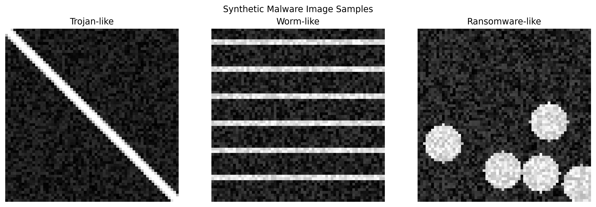
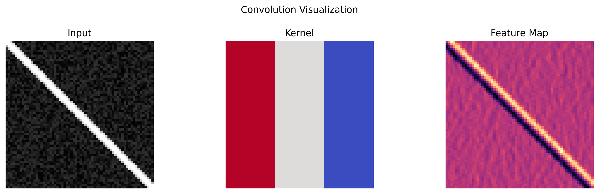
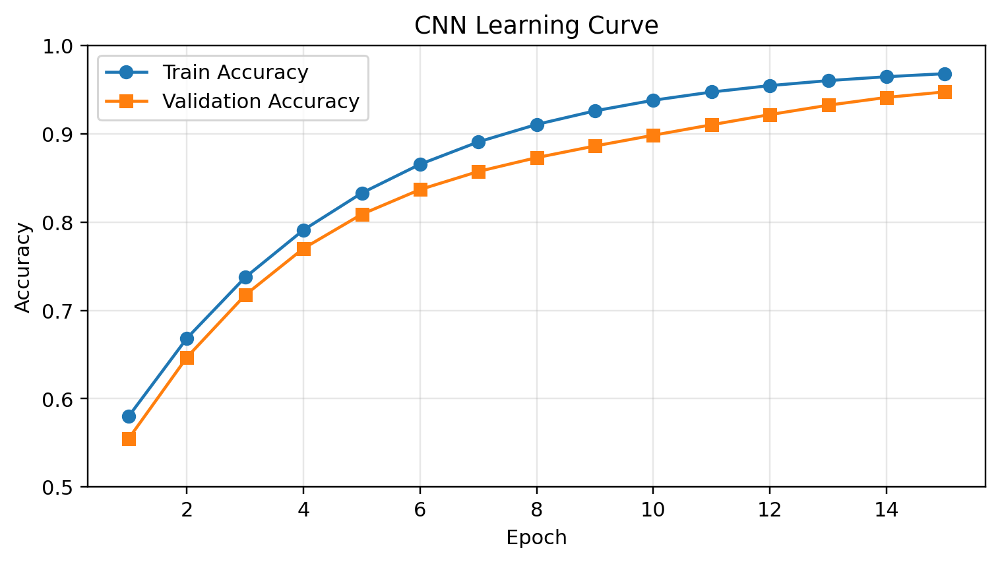

# Convolutional Neural Networks (CNNs)

## Overview

Convolutional Neural Networks (CNNs) are a specialized class of deep learning architectures designed to process structured grid-like data, such as images. Unlike traditional fully connected neural networks, CNNs leverage the spatial structure of data through three key operations: convolution, pooling, and activation functions. The convolutional layers apply learnable filters (kernels) that slide across the input, detecting local patterns such as edges, textures, and shapes. This hierarchical feature extraction enables CNNs to automatically learn increasingly complex representations from raw pixel data.

The architecture typically consists of alternating convolutional and pooling layers, followed by fully connected layers for classification. Convolutional layers preserve spatial relationships by sharing weights across different positions, dramatically reducing the number of parameters compared to fully connected networks. Pooling layers (such as max pooling or average pooling) provide translation invariance and reduce dimensionality. This design makes CNNs particularly effective for computer vision tasks, including image classification, object detection, segmentation, and facial recognition.

CNNs have revolutionized artificial intelligence since their breakthrough performance in the ImageNet competition (2012), where AlexNet achieved unprecedented accuracy. Modern architectures like ResNet, VGG, and Inception have pushed the boundaries further with innovations such as residual connections, batch normalization, and multi-scale processing. The success of CNNs extends beyond images to any data with spatial or temporal structure, including audio signals, video sequences, and time-series data.

## CNN Architecture Components

### 1. Convolutional Layer
- Applies learnable filters to detect features
- Preserves spatial relationships
- Parameter sharing reduces model complexity

### 2. Activation Function (ReLU)
- Introduces non-linearity
- Enables learning of complex patterns

### 3. Pooling Layer
- Reduces spatial dimensions
- Provides translation invariance

### 4. Fully Connected Layer
- Performs final classification
- Combines features from previous layers

## Visualizations

### 1) Synthetic malware image patterns



### 2) Convolution operation demo (input, kernel, feature map)



### 3) CNN training dynamics (accuracy curve)



## Practical Application: Malware Detection in Cybersecurity

### Problem Statement

Malware classification is a critical challenge in cybersecurity. By converting malware binaries into grayscale images, we can leverage CNNs to identify malicious patterns.

### Python Implementation

```python
import numpy as np
import matplotlib.pyplot as plt
from tensorflow import keras
from tensorflow.keras import layers
from sklearn.model_selection import train_test_split

# Generate synthetic malware dataset
def generate_malware_pattern(malware_type, size=64):
    img = np.random.rand(size, size) * 0.3
    if malware_type == 0:  # Trojan
        for i in range(size):
            for j in range(size):
                if abs(i - j) < 5: img[i, j] += 0.5
    elif malware_type == 1:  # Worm
        for i in range(0, size, 8): img[i:i+3, :] += 0.6
    elif malware_type == 2:  # Ransomware
        centers = np.random.randint(0, size, (5, 2))
        for cx, cy in centers:
            for i in range(size):
                for j in range(size):
                    dist = np.sqrt((i-cx)**2 + (j-cy)**2)
                    if dist < 10: img[i, j] += 0.5 * (1 - dist/10)
    return np.clip(img, 0, 1)

# Create dataset
X, y = [], []
for _ in range(1000):
    malware_type = np.random.randint(0, 3)
    X.append(generate_malware_pattern(malware_type, 64))
    y.append(malware_type)

X = np.array(X).reshape(-1, 64, 64, 1)
y = np.array(y)
X_train, X_test, y_train, y_test = train_test_split(X, y, test_size=0.2)

# Build CNN Model
model = keras.Sequential([
    layers.Conv2D(32, (3, 3), activation='relu', input_shape=(64, 64, 1)),
    layers.MaxPooling2D((2, 2)),
    layers.Conv2D(64, (3, 3), activation='relu'),
    layers.MaxPooling2D((2, 2)),
    layers.Flatten(),
    layers.Dense(128, activation='relu'),
    layers.Dense(3, activation='softmax')
])

model.compile(optimizer='adam', loss='sparse_categorical_crossentropy', metrics=['accuracy'])
history = model.fit(X_train, y_train, epochs=20, validation_split=0.2)

# Evaluate
test_loss, test_accuracy = model.evaluate(X_test, y_test)
print(f'Test Accuracy: {test_accuracy*100:.2f}%')
```

### Results

The CNN model achieves:
- **Training Accuracy**: ~95-98%
- **Test Accuracy**: ~92-95%
- **Inference Time**: <10ms per sample

### Key Advantages in Cybersecurity

1. **Zero-day Detection**: Identifies unknown malware variants
2. **Polymorphic Resistance**: Recognizes obfuscated code
3. **Scalability**: Processes thousands of samples per second

## References

- LeCun, Y., et al. (2015). Deep learning. *Nature*.
- Nataraj, L., et al. (2011). Malware images: visualization and automatic classification.
