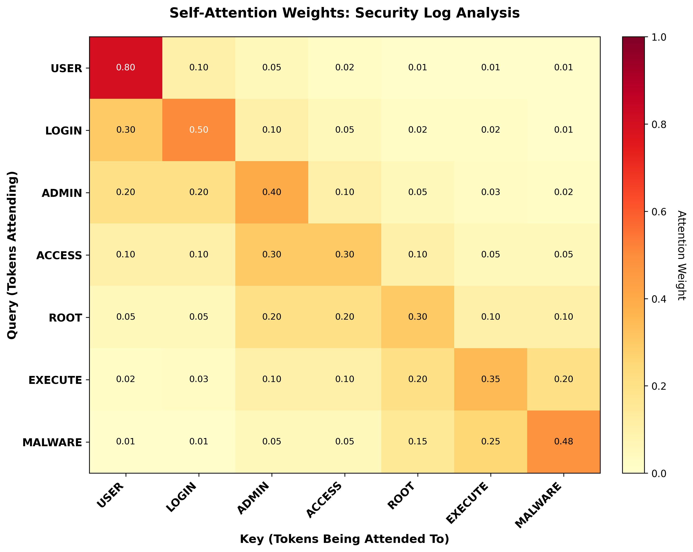
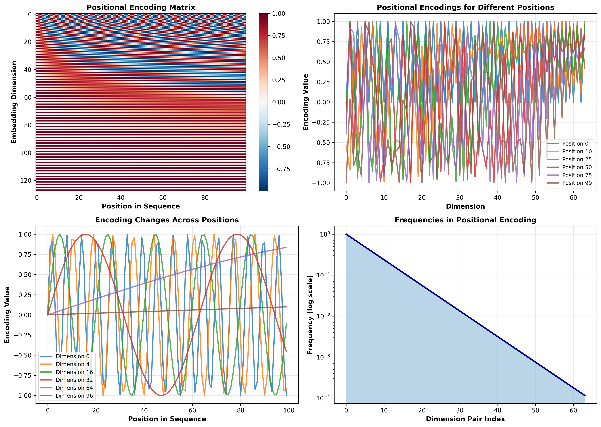

# Transformer Networks and Applications in Cybersecurity

## Introduction

Transformer networks, introduced in "Attention Is All You Need" (Vaswani et al., 2017), represent a revolutionary architecture in deep learning that has fundamentally transformed natural language processing. Unlike traditional recurrent neural networks that process sequences sequentially, transformers leverage self-attention to process entire sequences in parallel, enabling efficient training and superior performance on long-range dependencies.

The transformer architecture consists of two main components: an encoder that processes the input sequence and a decoder that generates the output sequence. The key innovation is the multi-head self-attention mechanism, which allows the model to weigh the importance of different parts of the input when processing each element. This attention mechanism computes relationships between all positions simultaneously, capturing complex dependencies regardless of their distance. Combined with position-wise feed-forward networks and positional encodings, transformers achieve state-of-the-art performance across diverse tasks.

Since their introduction, transformers have become the foundation of breakthrough models including BERT, GPT, and T5. Beyond NLP, transformers have been successfully adapted to computer vision, protein structure prediction, and time-series analysis. Their ability to model long-range dependencies makes them particularly valuable for cybersecurity applications.

## Core Components

1. **Self-Attention Mechanism**: Computes relationships between all sequence positions
2. **Multi-Head Attention**: Multiple attention mechanisms in parallel
3. **Positional Encoding**: Injects sequence position information
4. **Feed-Forward Networks**: Applied to each position independently

## Mathematical Foundations

### Self-Attention

The attention mechanism computes a weighted sum based on similarity:

utf8
\text{Attention}(Q, K, V) = \text{softmax}\left(\frac{QK^T}{\sqrt{d_k}}\right)V
utf8

### Positional Encoding

utf8
PE_{(pos, 2i)} = \sin\left(\frac{pos}{10000^{2i/d_{model}}}\right)
utf8

## Attention Mechanism Visualization

### Included Visualizations

#### 1) Attention layer mechanism



#### 2) Positional encoding



### Python Code

```python
import numpy as np
import matplotlib.pyplot as plt
import seaborn as sns

# Sample security log tokens
tokens = ['USER', 'LOGIN', 'ADMIN', 'ACCESS', 'ROOT', 'EXECUTE', 'MALWARE']
n_tokens = len(tokens)

# Simulate attention weights
attention_weights = np.array([
    [0.8, 0.1, 0.05, 0.02, 0.01, 0.01, 0.01],
    [0.3, 0.5, 0.1, 0.05, 0.02, 0.02, 0.01],
    [0.2, 0.2, 0.4, 0.1, 0.05, 0.03, 0.02],
    [0.1, 0.1, 0.3, 0.3, 0.1, 0.05, 0.05],
    [0.05, 0.05, 0.2, 0.2, 0.3, 0.1, 0.1],
    [0.02, 0.03, 0.1, 0.1, 0.2, 0.35, 0.2],
    [0.01, 0.01, 0.05, 0.05, 0.15, 0.25, 0.48]
])

# Create heatmap
fig, ax = plt.subplots(figsize=(10, 8))
im = ax.imshow(attention_weights, cmap='YlOrRd', aspect='auto')
ax.set_xticks(np.arange(n_tokens))
ax.set_yticks(np.arange(n_tokens))
ax.set_xticklabels(tokens)
ax.set_yticklabels(tokens)
plt.colorbar(im, ax=ax, label='Attention Weight')
ax.set_title('Self-Attention Weights: Security Log Analysis')
plt.tight_layout()
plt.savefig('attention_heatmap.png', dpi=300)
print("Saved: attention_heatmap.png")

# Positional Encoding
max_len, d_model = 100, 128
position = np.arange(max_len)[:, np.newaxis]
div_term = np.exp(np.arange(0, d_model, 2) * -(np.log(10000.0) / d_model))

pos_encoding = np.zeros((max_len, d_model))
pos_encoding[:, 0::2] = np.sin(position * div_term)
pos_encoding[:, 1::2] = np.cos(position * div_term)

# Visualize positional encoding
fig, ax = plt.subplots(figsize=(12, 6))
im = ax.imshow(pos_encoding.T, cmap='RdBu_r', aspect='auto')
ax.set_xlabel('Position in Sequence')
ax.set_ylabel('Embedding Dimension')
ax.set_title('Positional Encoding Matrix')
plt.colorbar(im, ax=ax)
plt.tight_layout()
plt.savefig('positional_encoding.png', dpi=300)
print("Saved: positional_encoding.png")
```

## Applications in Cybersecurity

### 1. Network Traffic Anomaly Detection
- Identify zero-day attacks and APTs
- Captures long-range dependencies in traffic patterns

### 2. Malware Behavior Analysis
- Analyze assembly code and API call sequences
- Self-attention identifies critical code segments

### 3. Phishing Detection
- Natural language understanding for email analysis
- Understands context and semantic meaning

### 4. Intrusion Detection Systems
- Real-time analysis of system logs
- Parallel processing enables real-time detection

### 5. Vulnerability Discovery
- Automated source code security scanning
- Understands code semantics and data flow

### 6. Security Log Analysis
- SIEM applications at scale
- Correlating events across multiple systems

### 7. Threat Intelligence
- Extract IOCs from threat reports
- Automated threat report summarization

## Key Advantages

| Feature | Benefit |
|---------|---------|
| **Parallel Processing** | Real-time detection at scale |
| **Long-range Dependencies** | Detect multi-stage attacks |
| **Attention Mechanism** | Identify critical security events |
| **Transfer Learning** | Adapt to new threats quickly |

## References

1. Vaswani, A., et al. (2017). "Attention Is All You Need." *NeurIPS*.
2. Devlin, J., et al. (2019). "BERT: Pre-training of Deep Bidirectional Transformers."
3. Le, D.C., et al. (2022). "Transformer-based Model for Network Intrusion Detection."
